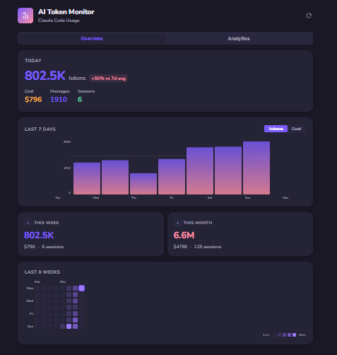
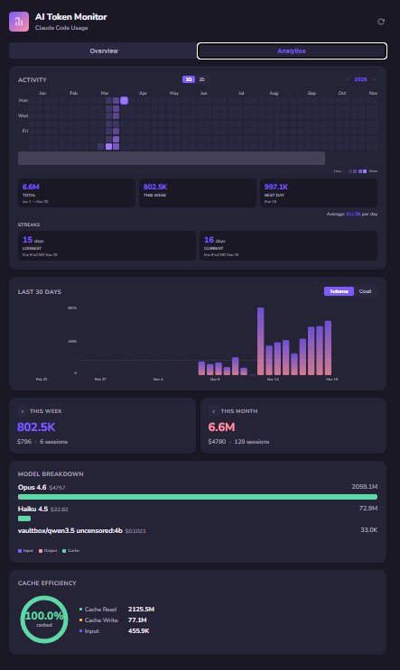

# React AI Token Monitor

A web-based dashboard for tracking Claude Code token usage and costs in real time. Runs as a lightweight Node.js server that reads Claude Code's session files and serves a React dashboard — accessible from any browser on your network.

Built as a web alternative to [ai-token-monitor](https://github.com/soulduse/ai-token-monitor) (Tauri desktop app) for headless servers and remote development setups.

<p align="center">
  <strong>Overview</strong><br/>
  <br/>
  <em>Today's usage, 7-day chart, weekly/monthly totals, contribution heatmap</em>
</p>

<p align="center">
  <strong>Analytics</strong><br/>
  <br/>
  <em>Full-year activity graph (2D/3D), 30-day trends, model breakdown, cache efficiency</em>
</p>

## Features

- **Real-time token tracking** — Parses Claude Code JSONL session files from `~/.claude/projects/`
- **Cost calculation** — Accurate pricing for Opus ($15/$75), Sonnet ($3/$15), and Haiku ($1/$5) per million tokens
- **Live updates** — File watcher detects new sessions and pushes updates via Server-Sent Events
- **Overview tab** — Today's summary, 7-day bar chart, weekly/monthly totals, contribution heatmap
- **Analytics tab** — Full-year activity graph (2D/3D), 30-day chart, model breakdown, cache efficiency donut
- **Pure SVG charts** — No chart library dependencies
- **Dark theme** — Purple dark theme by default
- **Remote access** — Binds to `0.0.0.0` so you can access it from any machine on your network

## Prerequisites

- Node.js 18+
- Claude Code installed and used at least once (needs `~/.claude/projects/` with session data)

## Quick Start

```bash
git clone git@github.com:outcomeops/react-ai-token-monitor.git
cd react-ai-token-monitor
npm install
npm run dev
```

Open `http://<your-server-ip>:5173` in your browser.

## Production

```bash
npm run build
npm start
```

Access at `http://<your-server-ip>:3002`.

## Architecture

Single Node.js process serving both the API and frontend:

- **Backend** (`server/`) — Express server that reads and parses JSONL files, serves stats via `GET /api/stats`, pushes live updates via SSE (`GET /api/events`), watches for file changes with chokidar
- **Frontend** (`src/`) — React + Vite with pure SVG chart components
- **Dev mode** — Vite dev server proxies `/api` requests to the Express backend
- **Production** — Express serves the Vite build from `dist/`

## Configuration

| Environment Variable | Default | Description |
|---|---|---|
| `PORT` | `3002` | API server port |
| `TZ` | System default | Timezone for date grouping (e.g., `America/Los_Angeles`). Set this to match your browser's timezone if the server is in a different timezone. |

## Model Pricing

Prices per million tokens (as of March 2026):

| Model | Input | Output | Cache Read | Cache Write |
|---|---|---|---|---|
| Opus | $15.00 | $75.00 | $1.50 | $18.75 |
| Sonnet | $3.00 | $15.00 | $0.30 | $3.75 |
| Haiku | $1.00 | $5.00 | $0.10 | $1.25 |

## License

[MIT](LICENSE.md)
